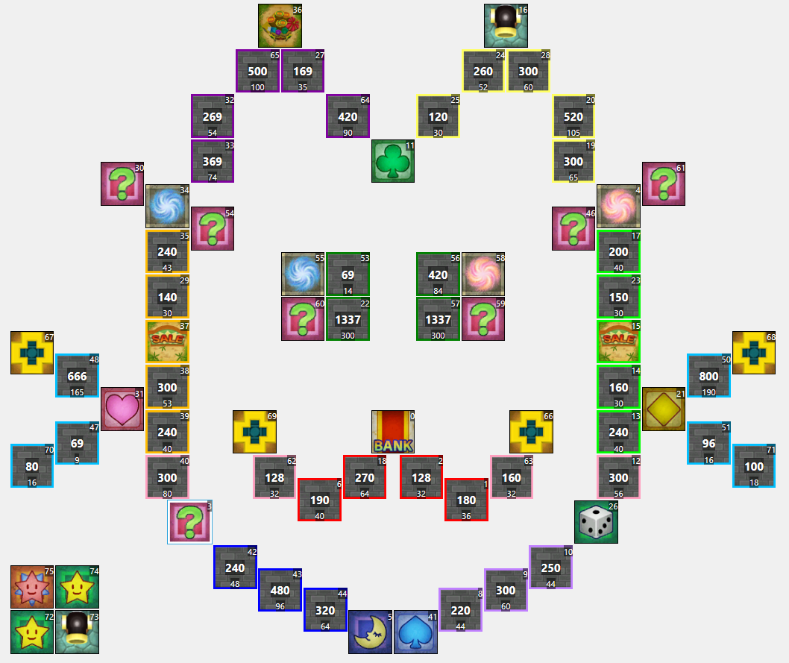

# Cat Map

I wanted to make a cute cat map.

You can only reach the bottom whiskers with a balloon, but if you can make it, the cyan district becomes powerful.
This map plays best with no vacant plots added.

Beware getting stuck on the meme eyelands!

## Screenshots

## Features

| Map Properties    | Value      |
| ----------------- | ---------- |
| Initial Cash      | 2240       |
| Target Amount     | 32000      | 
| Base Salary       | 320        | 
| Salary Increment  | 240        | 
| Maximum Dice Roll | 8          | 
| Looping Mode      | No Looping | 

## Prerequisites

- Needs to replace a map that supports cannons.
- Should replace a dragon quest themed map to avoid graphical glitches when using the 2 way doors.

## Changelog

### v2020.10.08
- I have added BOON SQUARE ISLAND at the request of Deflaktor. Although venture card 125 is a very rare card to pick, it is unfortunately necessary to include a boon square somewhere on the map. Cat Map was already purrfect so I did not include a very lame and uninteresting boon square on the original design of Cat Map. (although if I were to do so, the obvious tile choice is the Venture square on the bottom left).
- The addition of BOON SQUARE ISLAND changes gameplay in this way: 1) The cat now has a ball to play with. 2) in the late game, players may choose to warp here on purpose to temporarily escape high priced shops.

### v2017.05.31
- 2017 is the last time I worked on this. It may still benefit from some balancing changes, but overall a great map that has been thoroughly tested with friends. :-)

## Authors

- Logg
