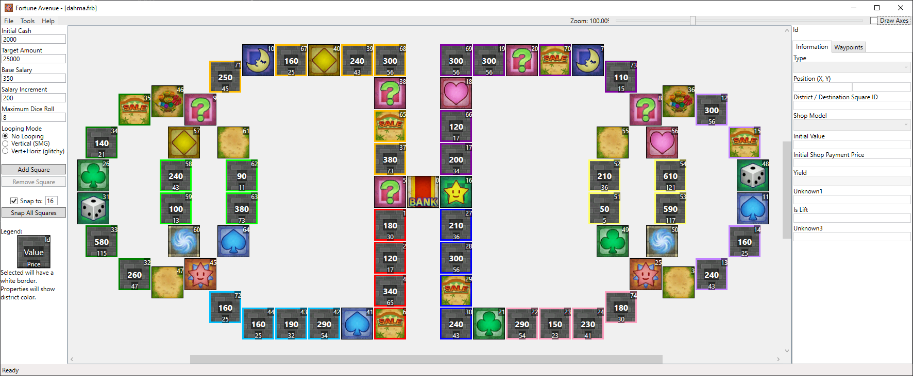

# Facing Worlds

In this map you need to go to each side to gather all 4 suits. Taking the warp is a good shortcut, if you are lucky enough to land on it. The switches are an alternative though they are also risky since you can end up helping your opponents instead.

## Screenshots

## Features

| Map Properties    | Value      |
| ----------------- | ---------- |
| Initial Cash      | 2000       |
| Target Amount     | 25000      | 
| Base Salary       | 350        | 
| Salary Increment  | 200        | 
| Maximum Dice Roll | 8          | 
| Looping Mode      | No Looping | 

## Prerequisites

- Needs the ASM hack for the 0x2E switch square
- Can be placed over any map, but dahma.frb is a good candidate due to the high target amount

## Changelog

### v1
- Initial Release

## Authors

- [Deflaktor](https://github.com/Deflaktor)