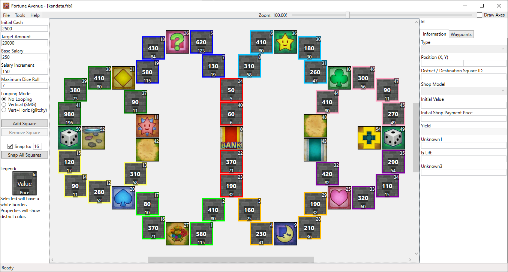

# Goodybag Lair

The switches summon a Goodybag, so buying shops around that area is of strategic importance.

## Screenshots

## Features

| Map Properties    | Value      |
| ----------------- | ---------- |
| Initial Cash      | 2500       |
| Target Amount     | 20000      | 
| Base Salary       | 250        | 
| Salary Increment  | 150        | 
| Maximum Dice Roll | 7          | 
| Looping Mode      | No Looping | 

## Prerequisites

- Needs the ASM hack for the 0x2E switch square
- Should replace a Dragon Quest themed map. "Robbin' Hood Ruins" kandata.frb is a good thematic fit.

## Changelog

### v1
- Initial Release

## Authors

- [Deflaktor](https://github.com/Deflaktor)