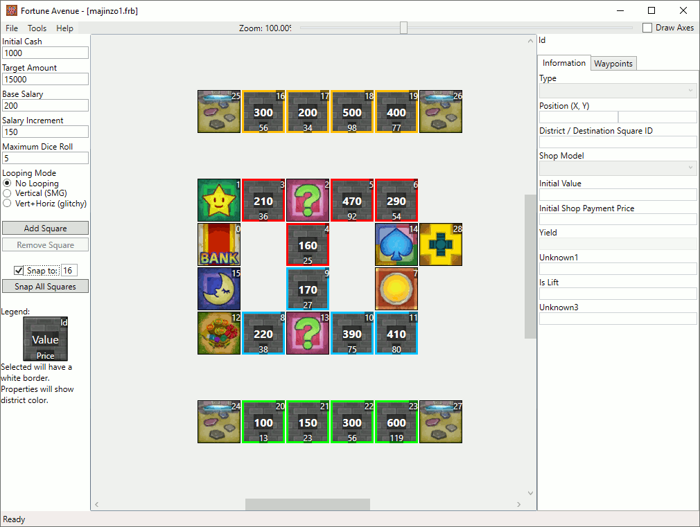

# King of the Hill

A fierce rivality between opposing factions is taking place on this map. The rivals constantly replace each others' districts with their own by pushing the switch over and over again. 

## Screenshots

## Features

| Map Properties    | Value      |
| ----------------- | ---------- |
| Initial Cash      | 1000       |
| Target Amount     | 15000      | 
| Base Salary       | 200        | 
| Salary Increment  | 150        | 
| Maximum Dice Roll | 5          | 
| Looping Mode      | No Looping | 

## Prerequisites

- Needs to replace "The Colossus" majinzo(0/1).frb

## Changelog

### v1
- Initial Release

## Authors

- [Deflaktor](https://github.com/Deflaktor)