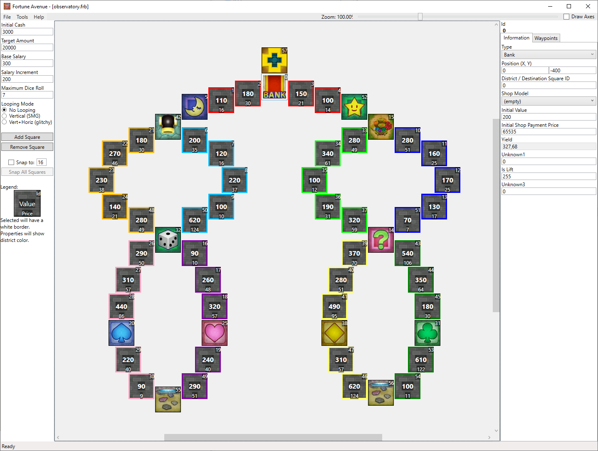

# Observatory

If you really hate large districts, here's a challenge: Almost every district has 5 shops in it. The cannon's a beast on this map, too.

## Screenshots

## Features

| Map Properties    | Value      |
| ----------------- | ---------- |
| Initial Cash      | 3000       |
| Target Amount     | 20000      | 
| Base Salary       | 300        | 
| Salary Increment  | 200        | 
| Maximum Dice Roll | 7          | 
| Looping Mode      | No Looping | 

## Prerequisites

- Should replace a Mario-themed map

## Changelog

### v1
- Initial Release

## Authors

- Ozzy Mandice