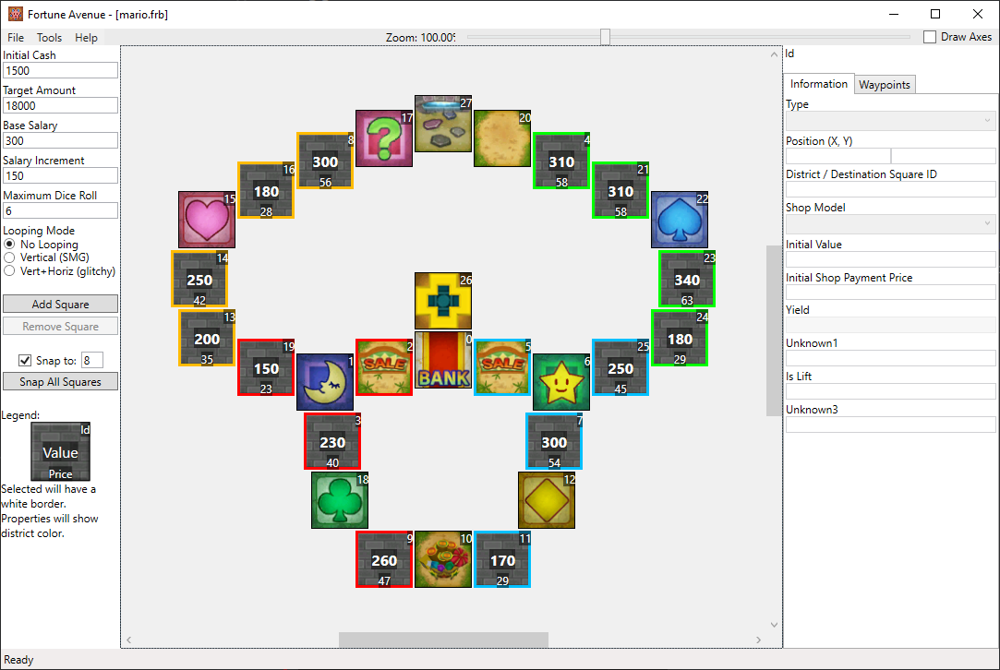

# Toad's House

Everytime someone steps on the switch, Lakitu will visit Toad's house. A small map where you can ramp up promotions quickly.

## Screenshots

## Features

| Map Properties    | Value      |
| ----------------- | ---------- |
| Initial Cash      | 1200       |
| Target Amount     | 18000      | 
| Base Salary       | 350        | 
| Salary Increment  | 150        | 
| Maximum Dice Roll | 6          | 
| Looping Mode      | No Looping | 

## Prerequisites

- Needs the ASM hack for the 0x2E switch square.
- Should replace a Mario themed map. "Super Mario Bros" mario.frb is a good thematic fit.

## Changelog

### v2
- Adjusted map so that Lakitu will appear less often
- Initial cash reduced from 1500 -> 1200
- Base salary increased 300 -> 350
- The shops near the bank are now vacant plots to make them more useful

### v1
- Initial Release

## Authors

- [Deflaktor](https://github.com/Deflaktor)