# How to upload a new map

The maps on this page are hosted on Github. To upload maps you need a Github Account.

To upload a new map you must create a pull request using the branch `master` as base. The pull request must contain the new folder for your map under the path `_maps/MyMap`. Your map folder must not contain any spaces. The folder must contain:
- 1 .yaml file (the map descriptor of your map)
- 1-4 .frb files (the board layout files of your map)
- 1-4 .webp files (the screenshots for each of your board layouts)

You can take a look at one of the map templates [GoodEggGalaxy](templateMaps/GoodEggGalaxy) or [KingOfTheHill](templateMaps/KingOfTheHill) or the other maps in this repository.

**Please test your map at least one full game before creating a pull request!**

## Step by step guide

1. Create a new folder at `C:\MyMap`, with `MyMap` being the name of your map. Open up CSMM and export the .yaml of your custom map to this directory.

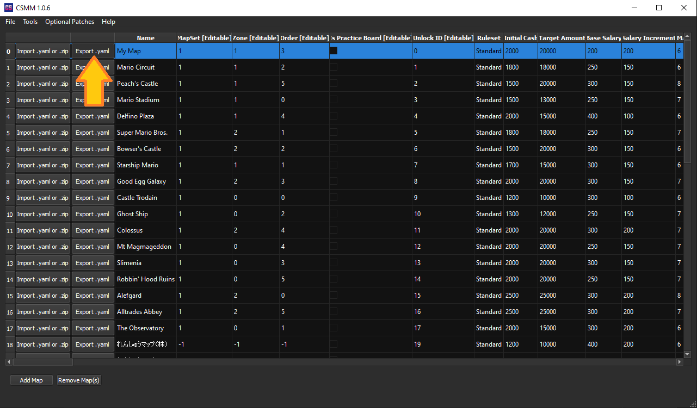

2. Prepare your map folder. Take a look into one of the map templates [GoodEggGalaxy](templateMaps/GoodEggGalaxy) or [KingOfTheHill](templateMaps/KingOfTheHill) how your map folder must look like.

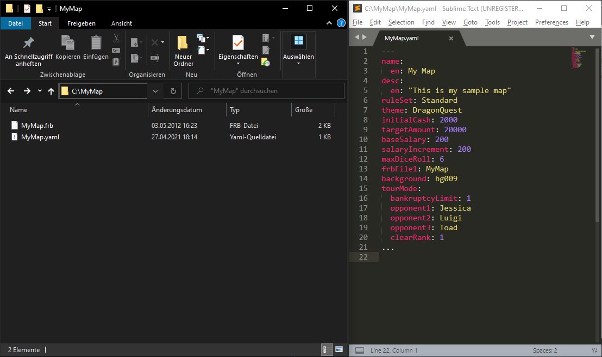

3. Now let's create the screenshots for your .frb files. For this, open up Fortune Avenue. Load any of your .frb files with Fortune Avenue, then go to `Tools -> Screenshot`.

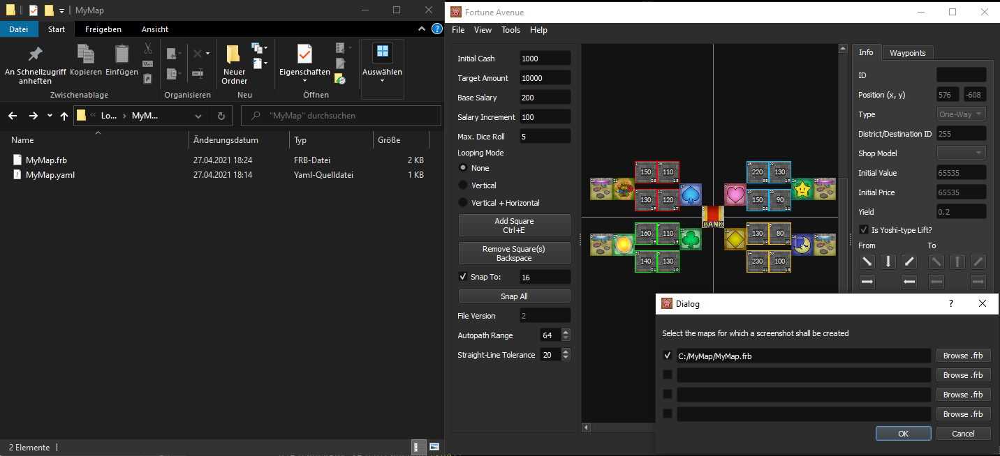

Make sure that the paths to the .frb files are correctly set. Click on OK and the screenshots in the form of .webp files should have been created.

4. You can edit your .yaml file and add author and changelog information to it.

```yaml
changelog:
  - version: 1
    added: 
      - Initial Release
authors:
  - name: <YOUR NAME>
    url: <YOUR WEBSITE>
```

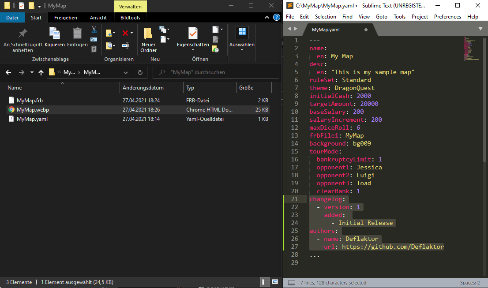

5. Now that your map folder is prepared, lets upload it. For this, the github repository needs to be forked. So head over to [https://github.com/FortuneStreetModding/fortunestreetmodding.github.io](https://github.com/FortuneStreetModding/fortunestreetmodding.github.io) and click on Fork.

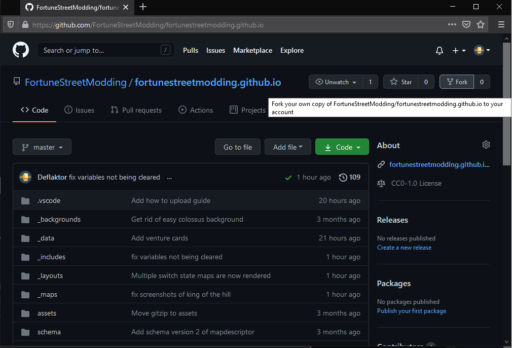

6. Navigate to the `_maps` folder.

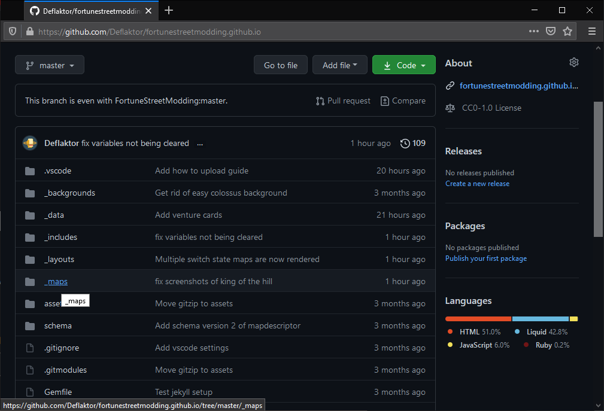

7. Drag'n'Drop your `MyMap` folder into the github window.

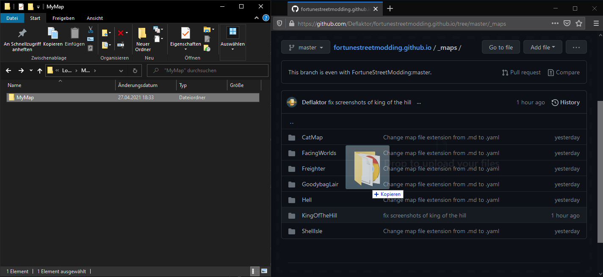

8. You can now enter a commit description, but you can also leave it as is. Make sure `Commit directly to the master branch` is selected.

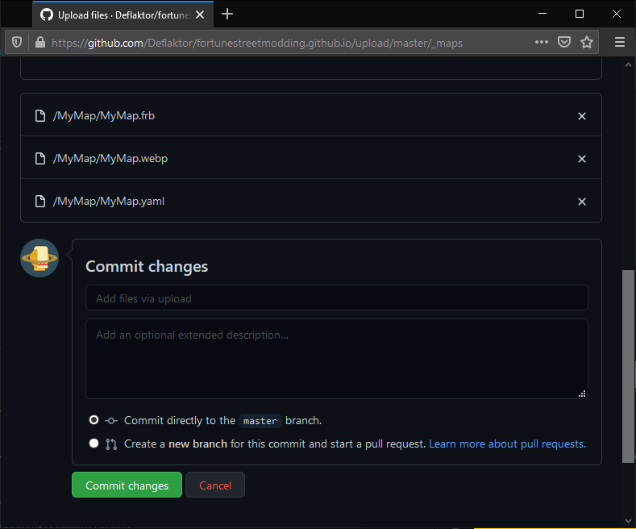

9. Now Github will tell you that your branch is at least 1 commit ahead of FortuneStreetModding:master. Click on the `Pull Request` link beside it to create a Pull Request.

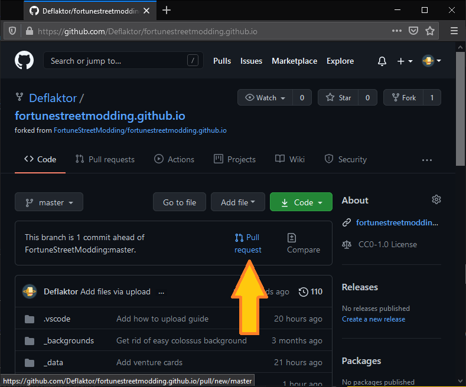

10. Make sure the base repository is `FortuneStreetModding` and that the head repository is your forked repository. When everything is well, click on `Create Pull Request`. Then give a small description for the pull request confirm the creation of the pull request.

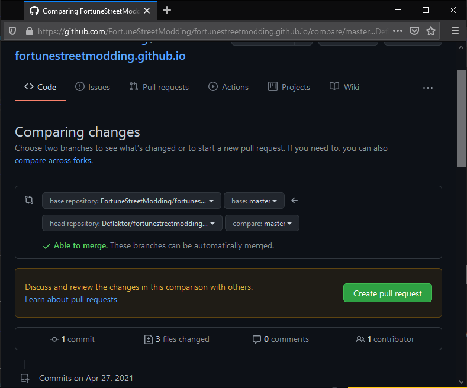

You are done! Thanks for your submission!

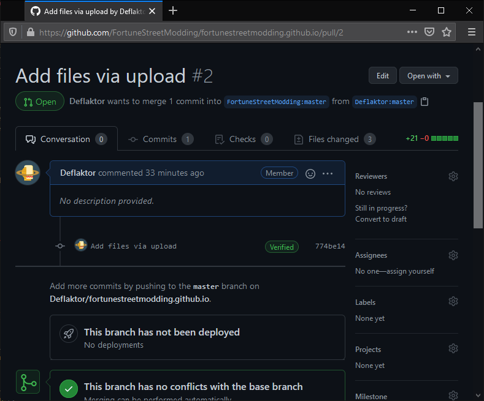